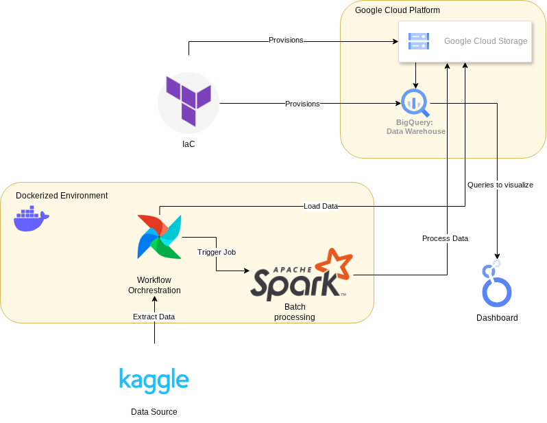

# S&P500 Stock Data Engineer Pipeline
## Problem statement
**Problem:** Investors and financial analysts need an automated, reliable way to track and analyze the daily composition and performance of the S&P 500 index across different market sectors. Manual aggregation of stock data is error-prone, slow, and doesn't scale well for historical analysis.

**Solution:** A scalable, automated batch data pipeline that extracts end-of-day S&P 500 stock data and company metadata, processes it in the cloud, and serves an interactive dashboard showing sector distributions and metrics help investors and analysts monitor and analyse S&P500 composition easier which clucial in risk management of investing portfolio.
## Overview

### Architecture & Technologies
This stack is designed to meet evaluation criteria for the Data Engineering Zoomcamp.

*   **Cloud Provider:** Google Cloud Platform (GCP)
*   **Infrastructure as Code (IaC):** Terraform
*   **Workflow Orchestration:** Apache Airflow (Dockerized)
*   **Data Lake:** Google Cloud Storage (GCS)
*   **Transformations:** Apache Spark / PySpark
*   **Data Warehouse:** Google BigQuery
*   **Dashboard / BI:** Google Looker Studio (or Metabase)