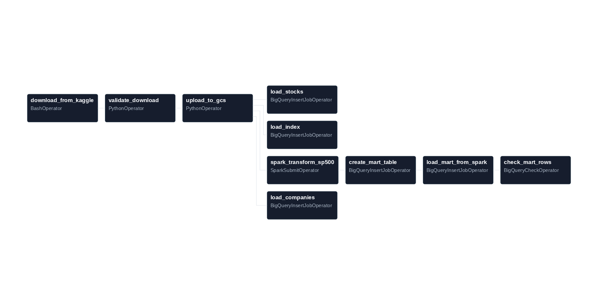
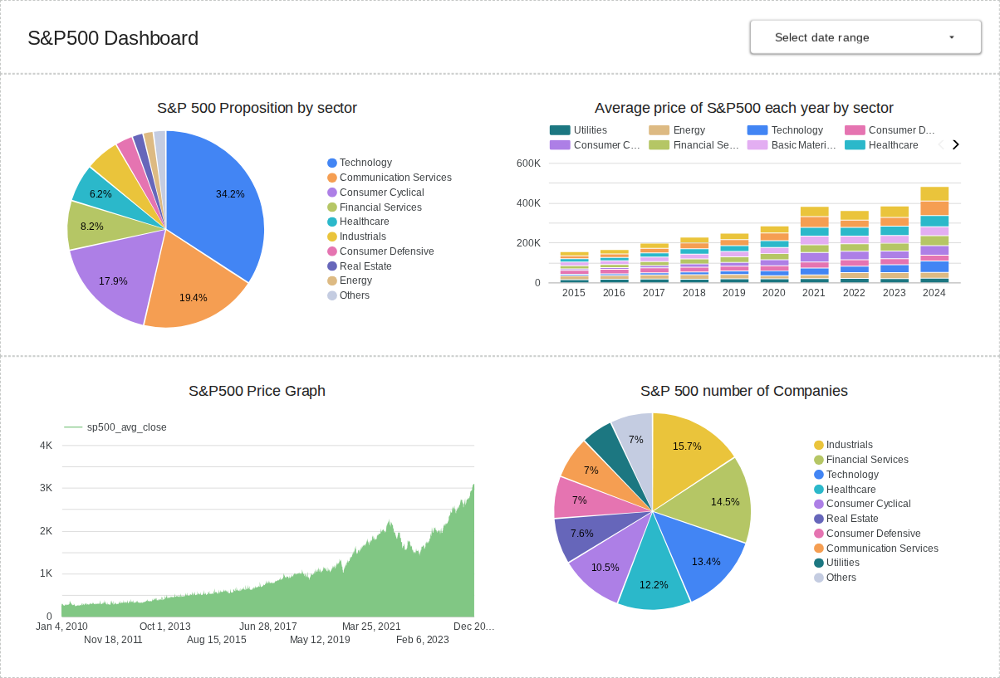
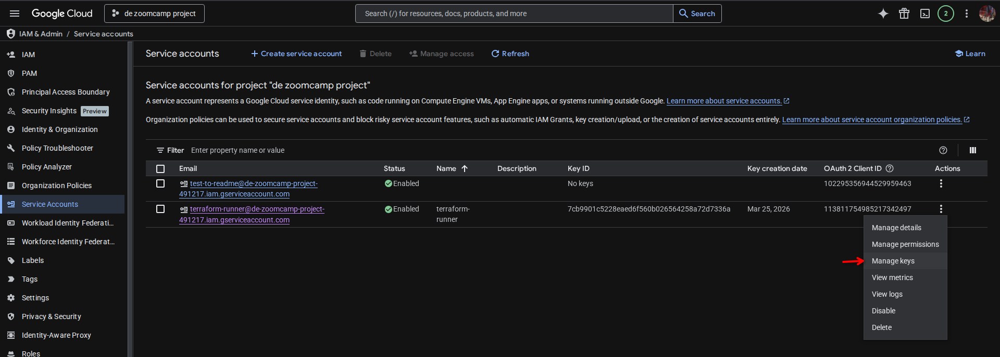
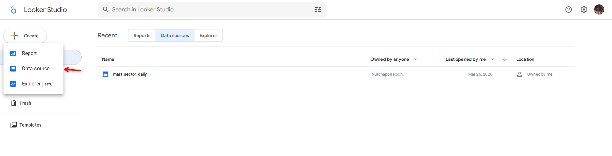
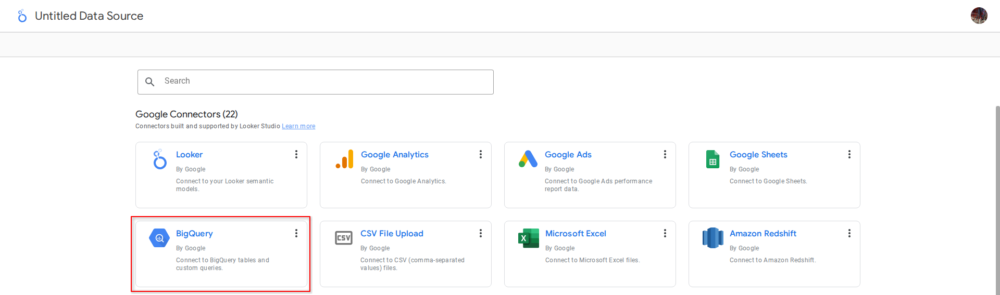
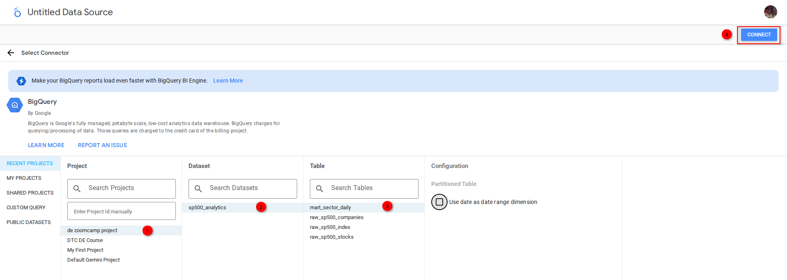

# S&P500 Stock Data Engineering Pipeline

## Overview
This project is an end-to-end batch data engineering pipeline for S&P500 analytics. It ingests daily market files from Kaggle, stores raw data in Google Cloud Storage, transforms data with Spark, loads curated tables into BigQuery, and powers a Looker Studio dashboard for sector and trend analysis.

The main goal is to provide a reproducible workflow that demonstrates orchestration, cloud storage, data warehouse modeling, and dashboard-ready transformations.

> Disclaimer: This repository is for educational and data engineering demonstration purposes only. It does not provide financial, trading, or investment advice.

## Problem description
Investors and financial analysts need a reliable way to monitor how the S&P500 changes over time and how each sector contributes to index behavior. Manual collection and aggregation is slow, error-prone, and difficult to maintain for historical analysis.

This project solves that with an automated batch pipeline that:
- Ingests S&P500 source files daily
- Stores raw files in a cloud data lake
- Transforms stock data with Spark using company weights
- Loads analytical tables into BigQuery
- Serves a Looker Studio dashboard with categorical and temporal tiles

## Project architecture


### Airflow DAG graph


Technology stack:
- Cloud: Google Cloud Platform
- Infrastructure as Code: Terraform
- Workflow orchestration: Apache Airflow
- Batch processing: Apache Spark with PySpark
- Data lake: Google Cloud Storage
- Data warehouse: BigQuery
- Dashboard: Looker Studio

## Repository structure
- [airflow/dags/dag.py](airflow/dags/dag.py): Main orchestration DAG
- [airflow/dags/scripts/transform_sp500.py](airflow/dags/scripts/transform_sp500.py): Spark transformation job
- [docker-compose.yaml](docker-compose.yaml): Airflow, Spark, Postgres, Redis services
- [terraform/main.tf](terraform/main.tf): GCS bucket and BigQuery dataset provisioning
- [terraform/variable.tf](terraform/variable.tf): Terraform variables
- [img/diagram.png](img/diagram.png): Architecture diagram
- [img/SP500_stock_data_download-graph.png](img/SP500_stock_data_download-graph.png): Airflow DAG graph
- [img/looker.png](img/looker.png): Looker Studio dashboard screenshot

## Data pipeline flow
Batch schedule: daily

1. Download from Kaggle in Airflow
- Task: download_from_kaggle
- Stores files locally in airflow data volume by run id

2. Validate raw files
- Task: validate_download
- Fails fast if no files were downloaded

3. Upload raw files to GCS
- Task: upload_to_gcs
- Writes to raw partition path by date

4. Load raw tables to BigQuery
- Tasks: load_stocks, load_companies, load_index

5. Spark transformation
- Task: spark_transform_sp500
- Reads raw stock and company files from GCS
- Computes weighted sector metrics and daily index-level weighted average close
- Writes parquet to processed path in GCS

6. Load transformed mart to BigQuery
- Tasks: create_mart_table, load_mart_from_spark

7. Data quality check
- Task: check_mart_rows
- Confirms mart table has rows

## BigQuery model details
Target mart table:
- mart_sector_daily

Core fields:
- date
- sector
- avg_close
- sp500_avg_close
- total_volume
- company_count
- weight_sector

Transform logic:
- Sector average close is weighted by company weight
- Daily S&P500 average close is also computed with weights

### Partition and Cluster

**Partition by date:**
- Dashboard users filter by date ranges (e.g., "last 30 days" or year-to-date)
- Partitioning by date prunes entire file blocks, avoiding scans of unneeded historical data
- With daily ingestion, one partition per day accumulates naturally—ideal for incremental loads
- Reduces BigQuery scan cost and query latency significantly

**Cluster by sector:**
- Primary categorical analysis is *by sector* (sector composition, sector price trends)
- Dashboard queries GROUP BY sector or filter WHERE sector = 'Technology'
- Clustering collocates all rows for the same sector in the same physical blocks on disk
- Queries that filter or aggregate by sector benefit from 10-100x faster retrieval

**Combined effect:**
When a user queries "Technology sector prices for March 2026", BigQuery:
1. Prunes by partition → reads only March 2026 blocks (not years of historical data)
2. Skips by cluster → reads only Technology blocks within that partition
3. Result: ~99% fewer bytes scanned than a full table scan

This strategy is optimal for your use case because dashboard queries naturally filter by both date (temporal tile) and sector (categorical tile).

## Dashboard
Dashboard tool: Looker Studio



Implemented tiles:
1. Categorical distribution tile
- S&P500 composition by sector based on volume

2. Temporal distribution tile
- Average S&P500 price trend over time by sector

Recommended dashboard extras:
- Date range control
- Clear chart titles and legends
- Axis labels and units

If you want to include a public dashboard link, add it in this section.

## Reproducibility guide

### Prerequisites
- Docker and Docker Compose
- Terraform
- Google Cloud project and service account key
- Kaggle API credentials
- A GCP project with billing enabled and BigQuery + GCS APIs enabled

### Required GCP roles and service accounts
Use one service account for runtime (Airflow + Spark) and one for Terraform.

Runtime service account suggested roles:
- Storage Admin
- BigQuery Admin

### Create service accounts, roles, and keys
1. In Google Cloud platform website go to IAM & Adimin --> Service Accounts --> Create service Account
2. Your preference account ID or the same name as terraform for easier terraform setting
3. then in permission section add Storage Admin role and BigQuery Admin role.
4. Done Creation

### 1) Configure credentials and environment
1. In APIs & Services --> API Library, enable `Cloud Storage` and `BigQuery API`
2. Get your credentials.json via IAM & Admin --> Service Accounts --> 3 dots of your service account ---> manage keys --> add key --> create new key --> JSON --> create. You will get the cred.json file. As you can follow in this instruction in terrform basic youtube video from zoomcamp course.

3. Put your GCP service account key for Terraform in terraform/cred.json and in airflow/config/gcp_crendentials.json

4. Verify files exist before running anything:

```bash
ls -l airflow/config/gcp_credentials.json terraform/cred.json .env
```

### 2) Provision cloud resources with Terraform
From the terraform directory:

```bash
cd terraform
terraform init
terraform plan
terraform apply
cd ..
```

>Don't forget to change variables project-id, bigquery dataset name base on your GCP.

Expected result:
- One GCS bucket is created
- One BigQuery dataset is created

Defaults in this project:
- BigQuery dataset: sp500_analytics
- Bucket: de-zoomcamp-project-bucket (Your bucket name)

**Create a .env file in repository root:**

```bash
AIRFLOW_UID=1000
KAGGLE_USERNAME=Username
KAGGLE_API_TOKEN=API_token
```

### 3) Start Airflow and Spark services
From repository root:

```bash
docker compose up -d --build
docker compose ps
```

Wait until these services are Up/healthy:
- airflow-apiserver
- airflow-scheduler
- airflow-worker
- airflow-triggerer
- postgres
- redis
- spark-master
- spark-worker

Airflow UI:
- http://localhost:8080
- Default user in this compose setup:
  username: airflow
  password: airflow

Spark master UI:
- http://localhost:8081

### 4) Configure Airflow Variables
Set required variables (either in UI or CLI). Required keys:
- KAGGLE_DATASET_SLUG
- GCS_BUCKET_NAME
- GCP_PROJECT_ID
- BQ_DATASET

Using the example or import in airflow/airflow_variables.json

CLI option (copy-paste):

```bash
docker compose run --rm airflow-cli airflow variables set KAGGLE_DATASET_SLUG andrewmvd/sp-500-stocks
docker compose run --rm airflow-cli airflow variables set GCS_BUCKET_NAME de-zoomcamp-project-bucket
docker compose run --rm airflow-cli airflow variables set GCP_PROJECT_ID de-zoomcamp-project-494324
docker compose run --rm airflow-cli airflow variables set BQ_DATASET sp500_analytics
```
> or using the given `airflow_variables.json`

### 5) Trigger pipeline
1. Open DAG named SP500_stock_data_download
2. Unpause the DAG if it is paused
3. Trigger a manual run/waiting for schedule run
4. Wait until all tasks complete successfully

Or trigger from CLI:

```bash
docker compose run --rm airflow-cli airflow dags unpause SP500_stock_data_download
docker compose run --rm airflow-cli airflow dags trigger SP500_stock_data_download
```

### 6) Validate outputs
Check these artifacts:
- Raw files in GCS under raw by date path
- Processed parquet in GCS under processed/sp500_sector_daily
- BigQuery table mart_sector_daily populated with rows

Suggested SQL check in BigQuery:

```sql
SELECT COUNT(*) AS row_count
FROM `de-zoomcamp-project-491217.sp500_analytics.mart_sector_daily`;
```

Success criterion:
- row_count > 0

You can see that there are 4 datasets in the Cloud Storage and BigQuery:
sp500_analytics
├── mart_sector_daily
├── raw_sp500_companies
├── raw_sp500_index
└── raw_sp500_stocks

### 7) Connect Looker Studio
1. Connect Looker Studio to BigQuery dataset



2. Build charts using mart_sector_daily

[**My Looker**](https://lookerstudio.google.com/reporting/f2504de2-1220-4cc0-af34-5903b5e2ac12)

### 8) Stop services and optional cleanup
Stop local stack:

```bash
docker compose down
```

Optional cloud cleanup to avoid cost:

```bash
cd terraform
terraform destroy -auto-approve
cd ..